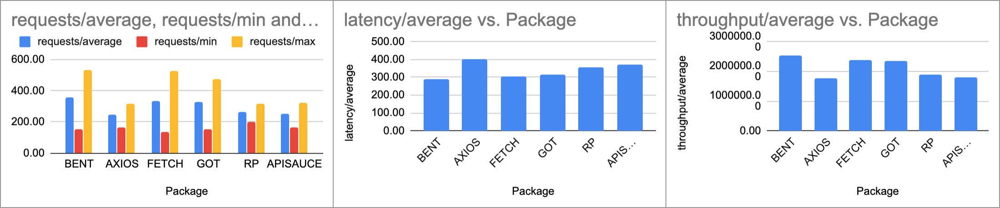

# 🌎 HTTP Clients benchmark


## Libraries

- [got](https://github.com/sindresorhus/got): Human-friendly and powerful HTTP request library for Node.js.

- [request-promise](https://github.com/request/request-promise): Simplified HTTP request client 'request' with Promise support. Powered by Bluebird. _DEPRECATED_.

- [node-fetch](https://github.com/bitinn/node-fetch): A light-weight module that brings window.fetch to Node.js.

- [axios](https://github.com/axios/axios): Promise based HTTP client for the browser and Node.js.

- [bent](https://github.com/mikeal/bent): Functional HTTP client for Node.js and Browsers w/ async/await.

- [apisauce](https://github.com/infinitered/apisauce): Axios + standardized errors + request/response transforms.

## Packages comparison

<table>
  <tr>
    <th></th>
    <th>request-promise</th>
    <th>node-fetch</th>
    <th>axios</th>
    <th>got</th>
    <th>bent</th>
    <th>apisauce</th>
  </tr>
  <tr>
    <td>Downloads</td>
    <td>2M/month</td>
    <td>11M/month</td>
    <td>6M/month</td>
    <td>34M/month</td>
    <td>5K/month</td>
    <td>54K/month</td>
  </tr>
  <tr>
    <td>Dependencies</td>
    <td><a href="https://npm.anvaka.com/#/view/2d/request-promise">7</a></td>
    <td><a href="https://npm.anvaka.com/#/view/2d/node-fetch">0</a></td>
    <td><a href="https://npm.anvaka.com/#/view/2d/axios">3</a></td>
    <td><a href="https://npm.anvaka.com/#/view/2d/got">15</a></td>
    <td><a href="https://npm.anvaka.com/#/view/2d/bent">3</a></td>
    <td><a href="https://npm.anvaka.com/#/view/2d/apisauce">2</a></td>
  </tr>
  <tr>
    <td>Minzipped size</td>
    <td>246.4KB *</td>
    <td>282B</td>
    <td>4.3KB</td>
    <td>18.4KB</td>
    <td>805B</td>
    <td>9.5KB</td>
  </tr>
  <tr>
    <td>Created at</td>
    <td>Oct 4, 2013</td>
    <td>Jan 26, 2015</td>
    <td>Aug 18, 2014</td>
    <td>Mar 27, 2014</td>
    <td>Nov 7, 2017</td>
    <td>Apr 9, 2016</td>
  </tr>
</table>

_* **Note:** request-promise has [request](https://github.com/request/request) as peer dependency. So this is the summatory of both packages sizes: 179.8KB + 66.6KB_


## Features

<table>
  <tr>
    <th></th>
    <th>request-promise</th>
    <th>node-fetch</th>
    <th>axios</th>
    <th>got</th>
    <th>bent</th>
    <th>apisauce</th>
  </tr>
  <tr>
    <td>HTTP/2 support</td>
    <td>❌</td>
    <td>❌</td>
    <td>❌</td>
    <td>❌</td>
    <td>❌</td>
    <td>❌</td>
  </tr>
  <tr>
    <td>Instances creation</td>
    <td>❌</td>
    <td>❌</td>
    <td>✅</td>
    <td>✅</td>
    <td>✅</td>
    <td>✅</td>
  </tr>
  <tr>
    <td>Promise API</td>
    <td>✅</td>
    <td>✅</td>
    <td>✅</td>
    <td>✅</td>
    <td>✅</td>
    <td>✅</td>
  </tr>
  <tr>
    <td>Stream API</td>
    <td>✅</td>
    <td>✅</td>
    <td>✅</td>
    <td>✅</td>
    <td>✅</td>
    <td>✅</td>
  </tr>
  <tr>
    <td>Request cancelation</td>
    <td>❌</td>
    <td>✅</td>
    <td>❌</td>
    <td>✅</td>
    <td>❌</td>
    <td>❌</td>
  </tr>
  <tr>
    <td>RFC compliant caching</td>
    <td>❌</td>
    <td>❌</td>
    <td>❌</td>
    <td>✅</td>
    <td>❌</td>
    <td>❌</td>
  </tr>
  <tr>
    <td>Cookies (out-of-box)</td>
    <td>✅</td>
    <td>❌</td>
    <td>❌</td>
    <td>✅</td>
    <td>❌</td>
    <td>❌</td>
  </tr>
  <tr>
    <td>Follows redirects</td>
    <td>✅</td>
    <td>✅</td>
    <td>✅</td>
    <td>✅</td>
    <td>✅</td>
    <td>✅</td>
  </tr>
  <tr>
    <td>Retries on failure</td>
    <td>❌</td>
    <td>❌</td>
    <td>❌</td>
    <td>✅</td>
    <td>❌</td>
    <td>❌</td>
  </tr>
  <tr>
    <td>Handles gzip/deflate</td>
    <td>✅</td>
    <td>✅</td>
    <td>✅</td>
    <td>✅</td>
    <td>✅</td>
    <td>✅</td>
  </tr>
  <tr>
    <td>Advanced timeouts</td>
    <td>❌</td>
    <td>❌</td>
    <td>❌</td>
    <td>✅</td>
    <td>❌</td>
    <td>❌</td>
  </tr>
  <tr>
    <td>JSON mode</td>
    <td>✅</td>
    <td>✅</td>
    <td>✅</td>
    <td>✅</td>
    <td>✅</td>
    <td>✅</td>
  </tr>
  <tr>
    <td>Composable</td>
    <td>❌</td>
    <td>❌</td>
    <td>❌</td>
    <td>✅</td>
    <td>✅</td>
    <td>❌</td>
  </tr>
  <tr>
    <td>Hooks</td>
    <td>❌</td>
    <td>❌</td>
    <td>✅</td>
    <td>✅</td>
    <td>❌</td>
    <td>❌</td>
  </tr>
</table>

* _Based on table from [got repository](https://github.com/sindresorhus/got#comparison)._


## Performance

Use autocannon for stress tests:

```bash
autocannon -c 100 -d 20 -m \"GET\" --json 'localhost:8080/<http_package_name>'
```

You can also run several tests using:

```bash
for i in {1..10}; do t -- 'localhost:8080/axios' >> ./benchmark_results/axios.json; sleep 5; done \
for i in {1..10}; do t -- 'localhost:8080/apisauce' >> ./benchmark_results/apisauce.json; sleep 5; done \
&& for i in {1..10}; do t -- 'localhost:8080/fetch' >> ./benchmark_results/fetch.json; sleep 5; done \
&& for i in {1..10}; do t -- 'localhost:8080/got' >> ./benchmark_results/got.json; sleep 5; done \
&& for i in {1..10}; do t -- 'localhost:8080/rp' >> ./benchmark_results/rp.json; sleep 5; done \
&& for i in {1..10}; do t -- 'localhost:8080/bent' >> ./benchmark_results/bent.json; sleep 5; done
```



<table class="table table-bordered table-hover table-condensed">
<thead><tr><th title="Field #1">Package</th>
<th title="Field #2">requests/average</th>
<th title="Field #3">requests/min</th>
<th title="Field #4">requests/max</th>
<th title="Field #5">requests/total</th>
<th title="Field #6">requests/sent</th>
<th title="Field #7">latency/average (ms)</th>
<th title="Field #8">latency/min (ms)</th>
<th title="Field #9">latency/max (ms)</th>
<th title="Field #10">throughput/average (bytes/sec)</th>
<th title="Field #11">throughput/min (bytes/sec)</th>
<th title="Field #12">throughput/max (bytes/sec)</th>
<th title="Field #13">throughput/total (bytes)</th>
<th title="Field #14">errors</th>
<th title="Field #15">timeouts</th>
<th title="Field #16">connections</th>
</tr></thead>
<tbody><tr>
<td>BENT</td>
<td align="right">356.26</td>
<td align="right">150.45</td>
<td align="right">531.73</td>
<td align="right">7125.09</td>
<td align="right">7226.00</td>
<td align="right">291.89</td>
<td align="right">21.45</td>
<td align="right">5386.92</td>
<td align="right">2546458.76</td>
<td align="right">1075449.09</td>
<td align="right">3800786.55</td>
<td align="right">50930149.82</td>
<td align="right">0.91</td>
<td align="right">0.91</td>
<td align="right">100</td>
</tr>
<tr>
<td>AXIOS</td>
<td align="right">245.76</td>
<td align="right">162.18</td>
<td align="right">318.18</td>
<td align="right">4915.27</td>
<td align="right">5018.27</td>
<td align="right">401.57</td>
<td align="right">23.09</td>
<td align="right">7887.79</td>
<td align="right">1756666.76</td>
<td align="right">1159275.64</td>
<td align="right">2274363.64</td>
<td align="right">35134369.45</td>
<td align="right">2.18</td>
<td align="right">2.18</td>
<td align="right">100</td>
</tr>
<tr>
<td>FETCH</td>
<td align="right">333.62</td>
<td align="right">134.27</td>
<td align="right">524.18</td>
<td align="right">6672.45</td>
<td align="right">6773.36</td>
<td align="right">305.73</td>
<td align="right">21.45</td>
<td align="right">6512.33</td>
<td align="right">2384680.15</td>
<td align="right">959781.45</td>
<td align="right">3746851.64</td>
<td align="right">47694705.09</td>
<td align="right">0.91</td>
<td align="right">0.91</td>
<td align="right">100</td>
</tr>
<tr>
<td>GOT</td>
<td align="right">328.77</td>
<td align="right">156.09</td>
<td align="right">475.73</td>
<td align="right">6575.36</td>
<td align="right">6676.00</td>
<td align="right">314.17</td>
<td align="right">28.45</td>
<td align="right">6127.15</td>
<td align="right">2350034.62</td>
<td align="right">1115737.82</td>
<td align="right">3400498.55</td>
<td align="right">47000699.27</td>
<td align="right">0.64</td>
<td align="right">0.64</td>
<td align="right">100</td>
</tr>
<tr>
<td>RP</td>
<td align="right">266.63</td>
<td align="right">197.27</td>
<td align="right">319.27</td>
<td align="right">5332.64</td>
<td align="right">5434.91</td>
<td align="right">355.15</td>
<td align="right">26.45</td>
<td align="right">7946.91</td>
<td align="right">1905893.82</td>
<td align="right">1410105.45</td>
<td align="right">2282161.45</td>
<td align="right">38117684.73</td>
<td align="right">2.27</td>
<td align="right">2.27</td>
<td align="right">100</td>
</tr>
<tr>
<td>APISAUCE</td>
<td align="right">253.05</td>
<td align="right">167.55</td>
<td align="right">321.55</td>
<td align="right">5061.09</td>
<td align="right">5163.64</td>
<td align="right">371.74</td>
<td align="right">24.64</td>
<td align="right">7714.74</td>
<td align="right">1808838.69</td>
<td align="right">1197614.91</td>
<td align="right">2298406.91</td>
<td align="right">36176677.82</td>
<td align="right">2.55</td>
<td align="right">2.55</td>
<td align="right">100</td>
</tr>
</tbody></table>


